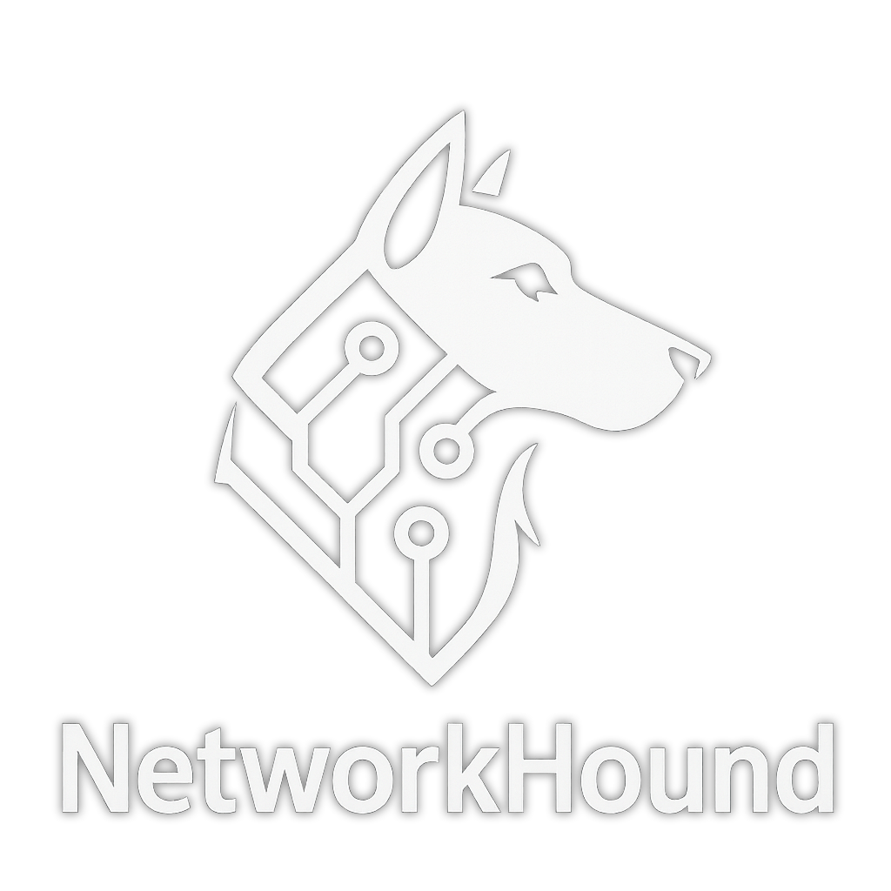

# 🐾 NetworkHound - Active Directory Network Topology Analyzer

<div align="center">




Advanced Active Directory network topology analyzer with SMB validation, multiple authentication methods (password/NTLM/Kerberos), and comprehensive network discovery. Export results as BloodHound‑compatible OpenGraph JSON.

</div>

---

## 🎯 Overview

NetworkHound connects to Active Directory Domain Controllers, discovers computer objects, resolves hostnames to IP addresses using multiple DNS methods, performs comprehensive network scanning (port scanning, HTTP/HTTPS validation), and discovers shadow-IT devices. It then builds a detailed network topology graph in OpenGraph JSON format compatible with BloodHound.

### What it gathers
- **Active Directory Objects**: Computer objects with SIDs and hostnames
- **Network Infrastructure**: Sites, Subnets, IP addresses, and network relationships
- **Port Scanning**: Open ports on all discovered devices with service identification
- **Web Services**: HTTP/HTTPS validation with SSL certificate analysis and website discovery
- **SMB Services**: SMB connectivity validation, share enumeration, and server information
- **Shadow-IT Discovery**: Non-domain devices found through subnet scanning
- **Network Topology**: Complete network relationships and device locations

---

## 🧩 Installation

Requirements: Python 3.8+

Install dependencies:

```bash
pip3 install -r requirements.txt
```

**Note**: NetworkHound uses `impacket` for all Active Directory authentication (password, NTLM hash, Kerberos tickets).

---

## 🛠️ Usage

### Step 1: Upload the model to BloodHound

The `model.json` file defines icons/styles for all custom kinds. Upload it to BloodHound via API using `update_custom_nodes_to_bloodhound.py`.

Authenticate and upload:

```bash
python update_custom_nodes_to_bloodhound.py -s https://bloodhound.example.com -u admin@domain.com -p "Password!" -m model.json
```

### Step 2: Usage

Basic scan with AD authentication:
```bash
python NetworkHound.py --dc 192.168.0.11 -d company.local -u admin -p password
```

Full network analysis with port scanning, HTTP and SMB validation:
```bash
python NetworkHound.py --dc 192.168.0.11 -d company.local -u admin -p password --shadow-it --port-scan --valid-http --ssl --valid-smb --scan-threads 50 -Pn
```

Using NTLM hash authentication:
```bash
python NetworkHound.py --dc 192.168.0.11 -d company.local -u admin --hashes aad3b435b51404eeaad3b435b51404ee:5fbc3d5fec8206a30f4b6c473d68ae76 
```

Using Kerberos ticket authentication:
```bash
python NetworkHound.py --dc dc.company.local -d company.local -u admin --kerberos
```

DNS over TCP (for proxy/firewall bypass):
```bash
python NetworkHound.py --dc dc.company.local -d company.local -u admin -p password --dns 8.8.8.8 --dns-tcp --verbose
```

Via proxychains with DNS over TCP:
```bash
proxychains python NetworkHound.py --dc dc.company.local -d company.local -u admin -p password --dns-tcp --port-scan
```

### CLI Arguments

**Required Arguments:**
- `--dc`: Domain Controller hostname or IP address
- `-d/--domain`: Domain name (e.g., company.local)
- `-u/--user`: Username for authentication

**Authentication (choose one):**
- `-p/--password`: Password authentication
- `--hashes`: NTLM hash authentication (LM:NT or just NT)
- `-k/--kerberos`: Kerberos ticket file (requires KRB5CCNAME pointing to a ccache file)

**Network Scanning:**
- `--port-scan`: Enable TCP port scanning
- `--ports`: Comma-separated ports to scan (default: common ports)
- `--scan-timeout`: Port scan timeout in seconds (default: 3)
- `--scan-threads`: Number of concurrent threads (default: 10)
- `-Pn`: Only port scan hosts that respond to ping

**Service Validation:**
- `--valid-smb`: Test SMB connectivity and enumerate shares on SMB ports
- `--valid-http`: Test HTTP/HTTPS connectivity on open ports
- `--ssl`: Extract detailed SSL certificate information (slower)

**Additional Options:**
- `--dns`: DNS server for queries (defaults to DC if not specified)
- `--dns-tcp`: Use TCP for DNS queries instead of UDP (useful for proxy/firewall bypass)
- `-o/--output`: Output JSON file (default: network_opengraph.json)
- `--shadow-it`: Scan subnet ranges for shadow-IT devices
- `-v/--verbose`: Enable verbose output with detailed resolution methods

---

## 🔍 Features

### 🌐 Multi-Method DNS Resolution
- **Socket Resolution**: Standard Python socket hostname resolution
- **nslookup**: Command-line DNS queries with specific DNS server (supports TCP with --dns-tcp)
- **dnspython**: Advanced DNS library with comprehensive record support (TCP/UDP)
- **getaddrinfo**: System-level address resolution
- **Hostname Fallback**: Short hostname resolution for AD environments
- **DNS over TCP**: Optional TCP mode for firewall bypass and proxy compatibility (--dns-tcp flag)

### 🔌 Advanced Port Scanning
- **Threaded Scanning**: Concurrent port scanning with configurable thread pools
- **Service Detection**: Automatic service identification for common ports
- **Ping Filtering**: Optional - skip ping before port scanning (-Pn flag)
- **Multiple IPs**: Support for computers with multiple IP addresses

### 🌐 HTTP/HTTPS Validation
- **Dual Protocol**: Test both HTTP and HTTPS on discovered ports
- **SSL Analysis**: Detailed SSL certificate information extraction
- **Website Discovery**: Automatic website title and content extraction
- **Certificate Validation**: Self-signed vs CA-issued certificate detection

### 📁 SMB Validation
- **SMB Connectivity**: Test SMB connections on ports 139 and 445
- **Share Enumeration**: List available SMB shares when permissions allow
- **Server Information**: Extract server name, domain, OS, and SMB version
- **Authentication Support**: Anonymous, password, and NTLM hash authentication
- **Access Analysis**: Determine guest access vs authentication requirements

### 👻 Shadow-IT Discovery
- **Subnet Scanning**: Discover non-domain devices in AD-configured subnets
- **Live Detection**: Ping sweep to identify responsive devices
- **Integration**: Include shadow-IT devices in unified port scanning

### 📊 Network Topology
- **OpenGraph Format**: BloodHound-compatible JSON structure
- **Hierarchical Structure**: Domain → Sites → Subnets → Computers/Devices
- **Relationships**: Complete network relationships and device locations
- **Website Nodes**: Separate nodes for discovered web services

---

## 🕸️ Graph Schema: Nodes/Edges

### Nodes

- **Domain** - Active Directory domain with SID
- **Site** - AD Sites and Services sites
- **Subnet** - Network subnets with CIDR notation and host counts
- **Computer** - AD computer objects with IPs, open ports, SMB services, and system info
- **Device** - Shadow-IT devices discovered through network scanning
- **Website** - HTTP/HTTPS services with SSL certificate details
- **FileShare** - SMB file shares with access information

### Edges

- **PartOfDomain** - `Site → Domain`
- **PartOf** - `Subnet → Site`
- **LocatedIn** - `Computer/Device → Subnet`
- **ExposeInterface** - `Computer/Device → Website/FileShare`

### Node Properties

**Computer/Device Nodes:**
- `ip_addresses[]`: All resolved IP addresses
- `open_ports[]`: Discovered open ports
- `is_shadow_it`: Boolean flag for shadow-IT devices

**Website Nodes:**
- `url`: Full website URL
- `protocol`: HTTP or HTTPS
- `status_code`: HTTP response code
- `has_ssl`: SSL/TLS enabled
- `is_self_signed`: Certificate validation status
- `ssl_*`: Detailed SSL certificate properties (when -s flag used)

**Subnet Nodes:**
- `subnet`: CIDR notation
- `network_address`: Network address
- `broadcast_address`: Broadcast address
- `host_count`: Number of hosts in subnet

---

## 📈 Output Example

```
NetworkHound - Active Directory Network Topology Analyzer
Author: Mor David (www.mordavid.com) | License: Non-Commercial

2025-09-19 01:26:07 - INFO - Starting NetworkHound
2025-09-19 01:26:07 - INFO - 🔗 STEP 1: Connecting to Domain Controller
2025-09-19 01:26:07 - INFO - 💻 STEP 2: Querying Active Directory Computer Objects
2025-09-19 01:26:07 - INFO - 🔍 STEP 3: Resolving Computer Hostnames to IP Addresses
2025-09-19 01:26:07 - INFO - 👻 STEP 4: Scanning for Shadow-IT Devices
2025-09-19 01:26:07 - INFO - 🔍 STEP 5: Network Port Scanning
2025-09-19 01:26:07 - INFO - 🌐 STEP 6: HTTP/HTTPS Validation
2025-09-19 01:26:07 - INFO - 📁 STEP 6.5: SMB Validation
2025-09-19 01:26:07 - INFO - 📊 STEP 7: Creating Network Topology Graph
2025-09-19 01:26:58 - INFO - ✅ ANALYSIS COMPLETED SUCCESSFULLY!
```

## 👨‍💻 About the Author

**Mor David** - Offensive Security Specialist & AI Security Researcher

I specialize in offensive security with a focus on integrating Artificial Intelligence and Large Language Models (LLM) into penetration testing workflows. My expertise combines traditional red team techniques with cutting‑edge AI technologies to develop next‑generation security tools.

### 🔗 Connect with Me
- **X (Twitter)**: [x.com/m0rd4vid](https://x.com/m0rd4vid)
- **LinkedIn**: [linkedin.com/in/mor-david-cyber](https://linkedin.com/in/mor-david-cyber)
- **Website**: [www.mordavid.com](https://www.mordavid.com)

---

<div align="center">

**⭐ Found this useful? Star the repo!**

Made with ❤️ by [Mor David](https://www.mordavid.com)

</div>
